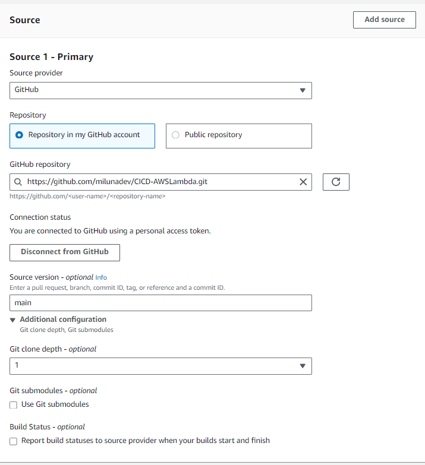
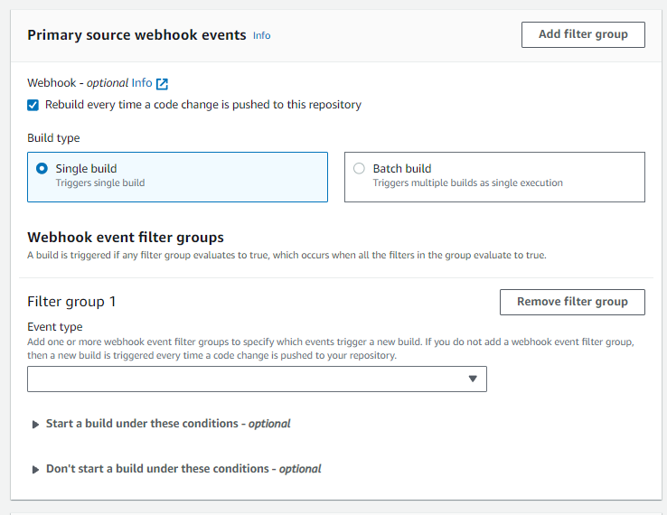

# CI/CD PIPELINE WITH LAMBDA

1. Levantamos una funcion Lambda por consola, CLI o como quieras. Yo lo hice con terraform, si usas los scripts no olvides setear primero tus keys, tu account ID como variable de Terraform y pasarle el ARN del rol que quieres que tenga Lambda.

```bash
export TF_VAR_AWS_ACCOUNT_ID="904569689818"
terraform init
terraform apply
```

2. Creamos un archivo python, segun el handler que definimos, en mi caso es un lambda_function.py con una funcion lambda_handler dentro.

3. Al usar librerias como pandas, crearemos un archivo de requirements.txt para que se instalen en la etapa de build.

4. Creamos un archivo **buildspec.yml** para definir los procesos de building. En este caso tenemos 3 fases:
- Install: Para descargar las librerias.
- Build: Zipear las librerias y el arifact de Lambda.
- Post-build: Subir el artifact a Lambda

5. Vamos a AWS Codebuild y creamos un proyecto, aqui elegimos la fuente que sera Github, podemos usar/crear una conexion o usar un personal acces token. Escogemos el repositorio y la rama.

Al ser un third-party source provider, debemos habilitar webhooks para que dispare el evento. Podemos filtro el tipo de evento tambien.

Tambien debemos elegir la imagen que queremos que corra, el rol de ser necesario otro, ingresar comandos o usar un archivo buildspec y CREAR EL PROYECTO.

6. Damos permiso al rol para interactuar con Lambda